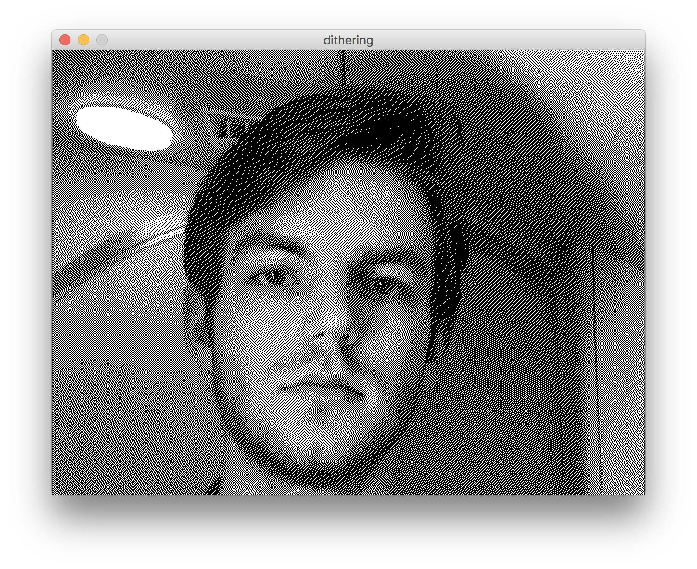

# misc

---

This is where I keep all my smaller projects/experiments that don't seem to belong anywhere else. Many of the folders above are simple examples of how to implement certain visual or aesthetic behaviors (metaballs, slit scan, etc.)

Photos!

