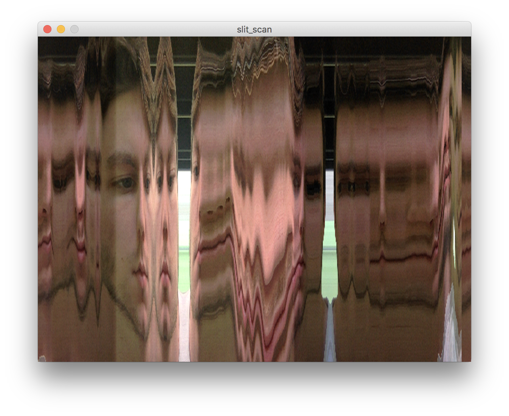
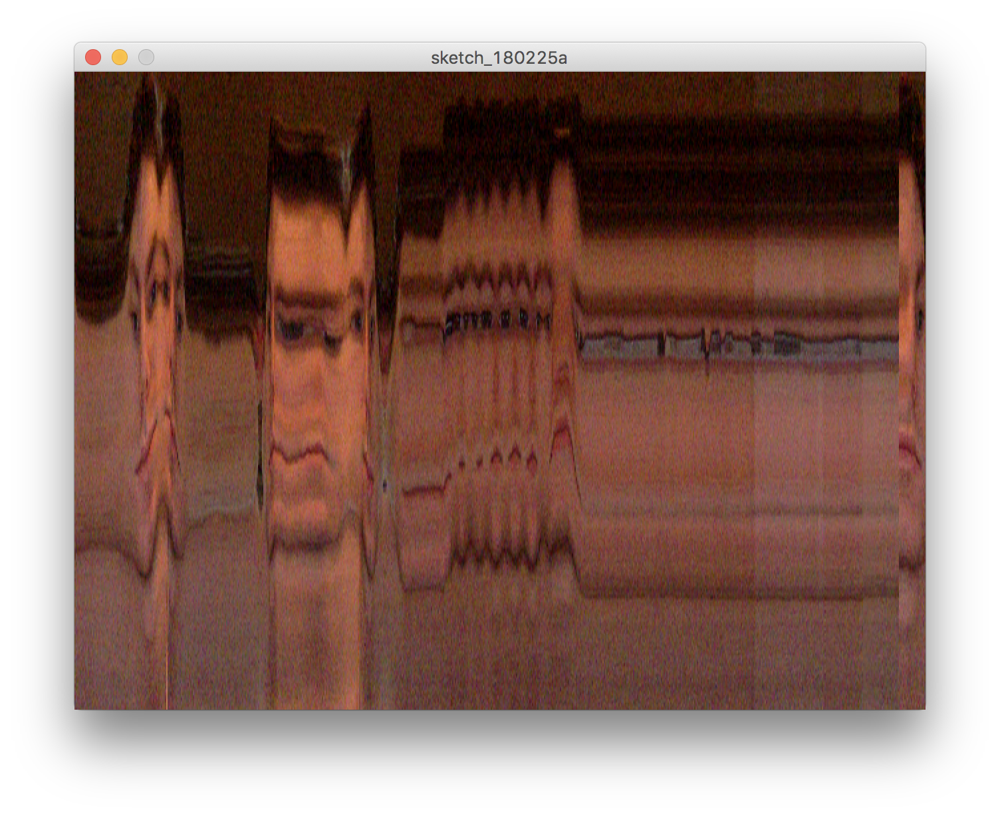

# slit scan

---

the first experiment in my series of self portraits, a basic slit scan

the algorithm traverses from the right side of the screen to the left, rendering the middle column of pixels retrieved from the webcam stream

in this way, the slit scan algorithm reduces the dimensionality of a movie, encoding a moment of time into a 2d image

